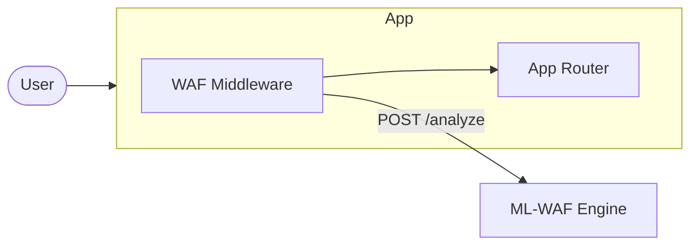
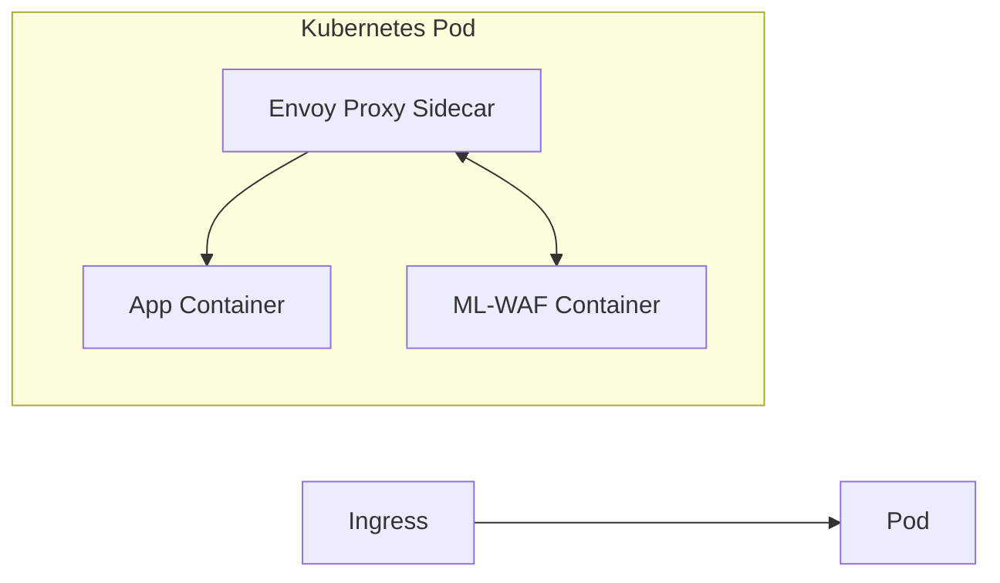

# Integrating ML-WAF into a Production Architecture

## Overview

The ML-WAF project acts as a standalone analysis engine. However, to actually protect a real web application, it must intercept HTTP traffic *before* it reaches your application servers. 

There are three primary architectural patterns for integrating an ML-based WAF into a production environment:

1. **Reverse Proxy (Recommended)** — WAF runs as an independent gateway.
2. **Application Middleware** — WAF runs inside your application process.
3. **Sidecar Container (Kubernetes)** — WAF runs alongside your app container.

---

## Deployment (Docker)

To make ML-WAF deploy-ready, this repository includes a `Dockerfile` and `docker-compose.yml`. 

To deploy the WAF in a production environment:

1. Build and start the container in the background:
   ```bash
   docker-compose up -d --build
   ```
2. The WAF will run on port `8000` (by default) and will be accessible to other containers in the same Docker network via the hostname `http://ml-waf:8000`.

**Best Practice:** Never hardcode `localhost` or specific IPs in your application code when integrating the WAF. Always use Environment Variables (like `WAF_URL`) so the same code works seamlessly across Local, Staging, and Production environments.

---

## 1. The Reverse Proxy Pattern (API Gateway)

This is the architecture used by Cloudflare, AWS WAF, and enterprise open-appsec deployments. 

In this model, the WAF is a separate service. All external internet traffic points to the WAF, and the WAF forwards safe traffic to your actual backend application.

```mermaid
graph LR
    User([User / Browser]) -->|HTTP Request| WAF[ML-WAF Nginx/Envoy]
    WAF -->|Analyze API| ML[ML-WAF Engine (FastAPI)]
    ML -.->|ALLOW / BLOCK| WAF
    WAF -->|Safe Traffic| Backend[Your Web App]
```

### How to Implement
You configure Nginx or Envoy to pause incoming requests, send a snapshot of the request to ML-WAF's `/analyze` endpoint, and wait for the response.

**Example Nginx (ngx_http_auth_request_module):**
```nginx
server {
    listen 80;
    server_name myapp.com;

    location / {
        # 1. Ask ML-WAF if the request is safe
        auth_request /waf_check;
        
        # 2. If safe, proxy to actual app
        proxy_pass http://backend_app:8080;
    }

    location = /waf_check {
        internal;
        # Use Docker network DNS or an upstream block instead of hardcoding localhost
        proxy_pass http://ml-waf:8000/analyze;
        proxy_pass_request_body on;
        proxy_set_header X-Original-URI $request_uri;
        proxy_set_header X-Real-IP $remote_addr;
    }
}
```

---

## 2. The Application Middleware Pattern

If you are running a single monolithic application (e.g., Express.js, Django, Spring Boot), you can integrate the WAF directly into your application's request pipeline as middleware. 

This is easier to set up but consumes your application server's CPU to wait for the WAF.



### Example (Node.js / Express)
```javascript
const axios = require('axios');

// Read the WAF URL from the environment (fallback to localhost for local dev)
const WAF_URL = process.env.WAF_URL || 'http://localhost:8000';

async function mlWafMiddleware(req, res, next) {
    try {
        // Send request snapshot to ML-WAF
        const wafResponse = await axios.post(`${WAF_URL}/analyze`, {
            method: req.method,
            url: req.originalUrl,
            headers: req.headers,
            body: req.body ? JSON.stringify(req.body) : '',
            ip: req.ip
        });

        if (wafResponse.data.block) {
            return res.status(403).send(`Blocked by WAF: ${wafResponse.data.reason}`);
        }
        
        // ML-WAF approved the request, let it pass through!
        next();
        
    } catch (err) {
        // Fail open if WAF is down
        console.error("WAF Connection Error:", err.message);
        next();
    }
}

app.use(mlWafMiddleware);
```

---

## 3. Kubernetes Sidecar Pattern

In modern microservices architectures, the WAF can run as a "sidecar" container inside the same Kubernetes Pod as your application container. 



This is how **open-appsec** natively deploys in Kubernetes. Envoy intercepts the traffic, asks the local ML-WAF container via gRPC/REST, and then routes to the application container on `localhost`.

---

## Ensuring Legitimate Traffic Passes Through (The "Normal" Baseline)

A critical part of integrating any ML-WAF is ensuring it doesn't block legitimate users. The integration relies on two mechanisms to achieve this:

1. **Supervised Training with Real Normal Data:**
   As explicitly detailed in `train.md`, the model is trained not just on attacks, but heavily mixed with **actual user requests and benign traffic**. The Random Forest learns the statistical bounds of normal usage (e.g., standard URL lengths, zero SQL keywords, low entropy). When a real user accesses your app, the model confidently scores it as `0.0` (benign) and lets it pass.

2. **Unsupervised Baselines (Isolation Forest):**
   Once integrated, the WAF observes your live, legitimate traffic via the Reverse Proxy or Middleware. The unsupervised engine builds a customized mathematical baseline of your specific web application. When a normal user logs in, it recognizes the pattern as part of the baseline, preventing false positives.

3. **Policy Overrides:**
   The integration allows you to use the Policy Engine (`/policy` endpoint) to whitelist trusted IPs (like your internal load balancers or health checkers) so they bypass the ML inference entirely, guaranteeing zero friction for critical infrastructure.
