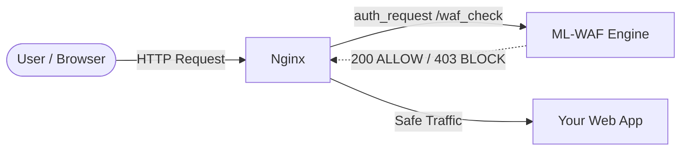
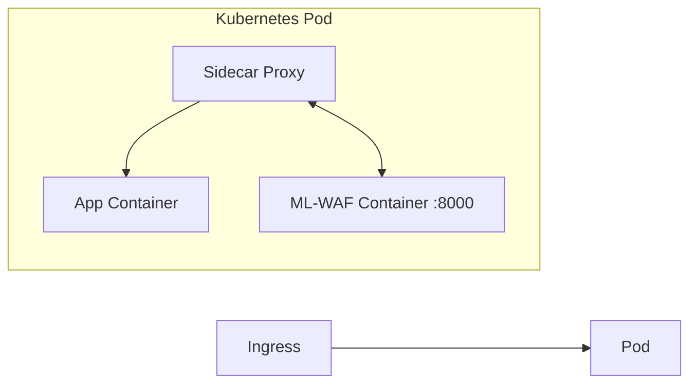

# Integrating ML-WAF into a Production Architecture

## Overview

The ML-WAF project acts as a standalone analysis engine. To protect a real web
application, it must intercept HTTP traffic *before* it reaches your
application servers.

There are three primary architectural patterns:

1. **Reverse Proxy (Recommended)** — WAF runs as an independent gateway,
   gated via `/waf_check`. No application code changes required.
2. **Application Middleware** — WAF runs alongside your app process,
   calling `/analyze` for full JSON detail.
3. **Sidecar Container (Kubernetes)** — WAF runs alongside your app
   container in the same Pod.

---

## Quick Start: Verified Demo

The repository ships with a working end-to-end demo: an intentionally
vulnerable Flask "shop" (`demo-app/`) sitting behind nginx, gated by
ML-WAF via `/waf_check`.

```bash
docker compose up -d --build

# Normal traffic — passes through to demo-app (200 OK)
curl http://localhost:8090/products?id=1

# Attack traffic — blocked by ML-WAF, nginx returns 403
curl "http://localhost:8090/login?user=admin&pass=' OR '1'='1"

# Live dashboard — see both requests appear in real time
open http://localhost:8090/waf-dashboard/
```

This is the fastest way to confirm ML-WAF is working before integrating it
with your own application. See [`deployment_guide.md`](deployment_guide.md)
for how to adapt this stack to a real backend.

---

## 1. The Reverse Proxy Pattern (`/waf_check`)

This is the recommended pattern, used by the verified demo above. ML-WAF
runs as a separate service. All traffic points at nginx (or any proxy
supporting `auth_request`-style sub-requests), which asks ML-WAF whether
each request is safe before forwarding it to your backend.



`/waf_check` is purpose-built for this: unlike `/analyze` (which always
returns HTTP 200 with a JSON `decision` field), `/waf_check` returns
**HTTP 200 for ALLOW** and **HTTP 403 for BLOCK** — exactly what
`auth_request` needs, since it can only gate on status codes.

### Nginx configuration

This is the configuration used by the verified demo
(`nginx/nginx.conf`):

```nginx
http {
    client_body_buffer_size 128k;
    client_max_body_size 10m;

    server {
        listen 80;

        location = /waf_check {
            internal;
            proxy_pass http://ml-waf:8000/waf_check;
            proxy_pass_request_body on;
            proxy_set_header Content-Length $content_length;
            proxy_set_header Content-Type $content_type;
            proxy_set_header X-Original-URI $request_uri;
            proxy_set_header X-Original-Method $request_method;
            proxy_set_header X-Real-IP $remote_addr;
            proxy_set_header X-Forwarded-For $proxy_add_x_forwarded_for;
        }

        location / {
            auth_request /waf_check;
            error_page 403 = /blocked;

            proxy_pass http://your-backend:8080;
            proxy_set_header Host $host;
            proxy_set_header X-Real-IP $remote_addr;
            proxy_set_header X-Forwarded-For $proxy_add_x_forwarded_for;
        }

        location = /blocked {
            internal;
            default_type application/json;
            return 403 '{"error": "Request blocked by ML-WAF"}';
        }
    }
}
```

Replace `your-backend:8080` with your application's hostname/port. See
[`deployment_guide.md`](deployment_guide.md) for a step-by-step walkthrough
of adapting this for a real site.

---

## 2. The Application Middleware Pattern (`/analyze`)

If reverse-proxy isn't an option (e.g. you can't change your ingress
config), call `/analyze` directly from your application's request
pipeline. `/analyze` always returns HTTP 200 with a JSON body containing
`decision` (`ALLOW`/`BLOCK`), `reason`, `attack_type`, `confidence`, and
extracted `features`.


### Example (Node.js / Express)

```javascript
const axios = require('axios');

const WAF_URL = process.env.WAF_URL || 'http://localhost:8000';

async function mlWafMiddleware(req, res, next) {
    try {
        const wafResponse = await axios.post(`${WAF_URL}/analyze`, {
            method: req.method,
            url: req.originalUrl,
            headers: req.headers,
            body: req.body ? JSON.stringify(req.body) : '',
            ip: req.ip
        }, { timeout: 500 });

        if (wafResponse.data.decision === 'BLOCK') {
            return res.status(403).send(`Blocked by WAF: ${wafResponse.data.reason}`);
        }

        next();
    } catch (err) {
        // Fail open if WAF is down or times out
        console.error("WAF Connection Error:", err.message);
        next();
    }
}

app.use(mlWafMiddleware);
```

Ready-made snippets for Python, PHP, Java, Go, and Docker/Kubernetes
sidecars are available via `GET /integrations/{lang}` and in the
dashboard's **Integration** tab.

---

## 3. Kubernetes Sidecar Pattern

ML-WAF can run as a sidecar container in the same Pod as your application,
with the in-Pod proxy (Envoy, nginx, etc.) calling it over `localhost`.



A ready-to-use Deployment/Service manifest is available via:

```bash
curl http://localhost:8000/integrations/kubernetes
```

It defines the ML-WAF container as an additional container in your pod
spec, exposing port 8000 on `localhost` to the app/proxy container. See
[`deployment_guide.md`](deployment_guide.md) for an `nginx-ingress`
`auth-url` annotation example that points at `/waf_check`.

---

## Troubleshooting

- **Fail-open by design**: every middleware snippet wraps the WAF call in
  a try/catch and calls `next()` (or equivalent) on error/timeout. If
  ML-WAF is unreachable, traffic passes through unfiltered rather than
  taking your site down. Monitor `/health` to detect this condition.
- **Latency budget**: snippets use a ~500ms timeout. `/analyze` and
  `/waf_check` typically respond in single-digit milliseconds; a timeout
  usually means ML-WAF is overloaded or down, not that inference is slow.
- **TLS termination**: ML-WAF does not terminate TLS. Terminate TLS at
  your reverse proxy/ingress as usual; ML-WAF only ever sees
  proxied/forwarded plaintext requests.
- **Body buffering**: `auth_request` requires nginx to buffer the full
  request body before forwarding it to `/waf_check`. For very large
  uploads this doubles memory usage during the request — consider
  excluding large-upload routes from the `auth_request` gate if this
  becomes an issue.
- **403 from `/waf_check` but you expected ALLOW**: check
  `GET /policy` for current thresholds and rules, and see "Tuning
  thresholds" below.

---

## Tuning Thresholds (Reducing False Positives)

ML-WAF ships with default thresholds (`ml_block_score: 0.50`,
`unsupervised_block_score: 0.75`, `combined_block_score: 0.65`). If your
site's legitimate traffic is being blocked, or attacks are slipping
through, you can tune these per-deployment:

1. **Adjust thresholds directly** via `PUT /policy/thresholds` (or the
   sliders in the dashboard's Policy tab):

   ```bash
   curl -X PUT http://localhost:8000/policy/thresholds \
     -H "Content-Type: application/json" \
     -d '{"ml_block_score": 0.6}'
   ```

2. **Feed in site-specific labeled examples** via
   `POST /ml/upload_labeled` (JSON/CSV/JSONL of requests labeled `0`
   benign / `1` malicious). ML-WAF augments these into synthetic variants
   and stores them in `data/custom_labeled.jsonl`. Then trigger
   `POST /ml/retrain` (or click "Retrain Model" in the dashboard) to
   fold them into the supervised model.

3. **Use Policy overrides** to allowlist trusted IPs/paths (internal
   load balancers, health checks) so they bypass ML inference entirely —
   `POST /policy/rules` for a single rule, or `POST /policy/rules/bulk`
   to add many at once.

4. **Let the unsupervised baseline learn**: once integrated, ML-WAF's
   Isolation Forest baseline observes your live traffic and adapts to
   your application's normal request patterns over time, reducing false
   positives without manual tuning.
